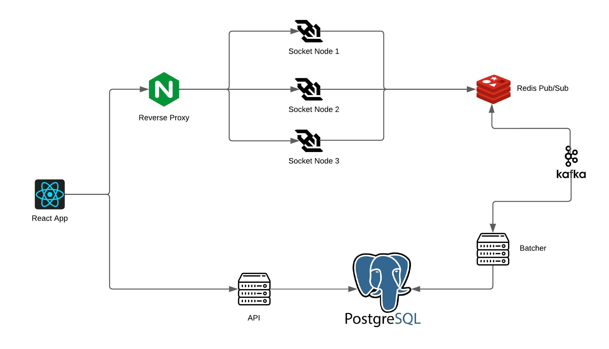
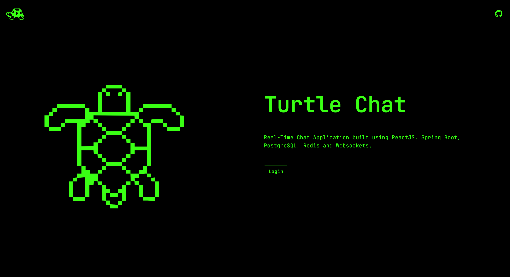
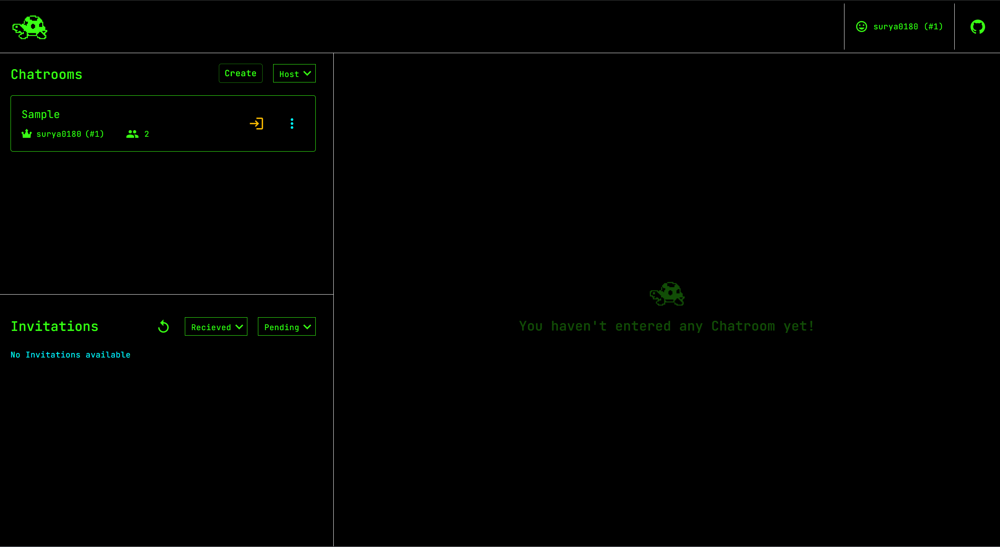
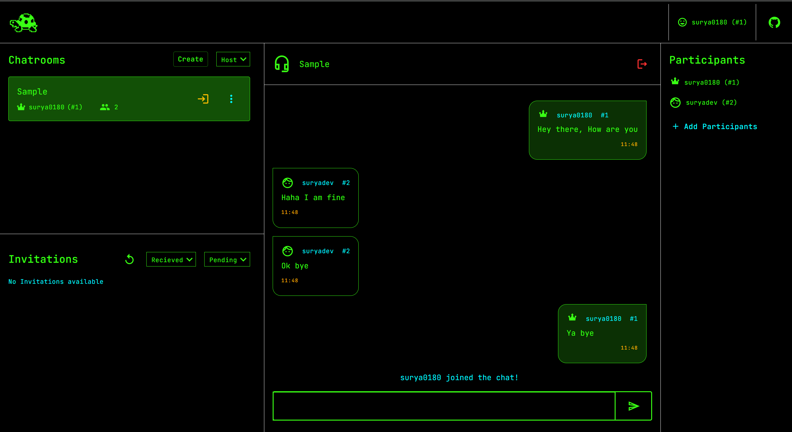

# 🐢 Turtle Chat

**Turtle Chat: Built with the philosophy that meaningful conversations take their time. Slow and steady, just like the turtle, it’s designed to be reliable and thoughtful, ensuring every message counts.**

Welcome to **Turtle Chat**, a modern and secure chat application that simplifies the way users connect and communicate. With OTP-based login, chatroom creation, real-time messaging, and scalable architecture, Turtle Chat provides a seamless and efficient chatting experience.

## 📝 Table of Contents

- [Features](#-features)
- [Architecture Overview](#-architecture-overview)
- [Frontend](#-frontend)
- [Backend](#-backend)
  - [Main Server](#main-server)
  - [Socket Application](#socket-application)
  - [Batcher Service](#batcher-service)
- [Technology Stack](#-technology-stack)
- [Installation](#-installation)
- [Usage](#-usage)
- [Screenshots & GIFs](#-screenshots--gifs)
- [Contributing](#-contributing)
- [License](#-license)

## 🌟 Features

- **OTP-Based Login:** Secure login via email OTP; no passwords needed.
- **Chatrooms:** Create and manage chatrooms, join others with invitations.
- **Real-time Messaging:** Live chat using WebSockets with support for multiple clients.
- **Invitations:** Invite others to join your chatrooms.
- **Chatroom Management:** Delete chatrooms when they are no longer needed.
- **Scalable Architecture:** Built to handle concurrent users and messages efficiently.

## 🤖 Architecture Overview

Turtle Chat is designed with scalability and efficiency in mind, utilizing a microservices architecture. Here's a high-level overview of the system:

1. **Main Server (REST API):**

   - Handles authentication, chatroom CRUD operations, and invitations.
   - Built with Java Spring Boot.

2. **Socket Application (WebSockets):**

   - Manages real-time message exchange between clients in chatrooms.
   - Consists of three nodes running in Docker containers, each connected to a Redis PubSub for message broadcasting.
   - Publishes messages to a Kafka pipeline for further processing.

3. **Batcher Service:**
   - Consumes messages from the Kafka pipeline in batches.
   - Efficiently stores messages in the database, ensuring persistence and scalability.



## 🎨 Frontend

The frontend of Turtle Chat is developed using **React JS**, providing a responsive and user-friendly interface for all devices. Users can log in, create or join chatrooms, and interact with others in real-time.

## 💻 Backend

### Main Server

The main server is a **Java Spring Boot** application responsible for:

- **User Authentication:** Handles OTP verification via email.
- **Chatroom Management:** Supports CRUD operations for chatrooms and managing invitations.
- **REST API:** Exposes endpoints for the frontend to interact with the backend.

### Socket Application

The Socket application handles the core functionality of real-time messaging:

- **WebSocket Connection:** Facilitates live communication between users.
- **Redis PubSub Integration:** Ensures all Socket nodes receive and broadcast messages to clients in the respective chatrooms.
- **Kafka Integration:** Publishes messages to a Kafka pipeline for further processing by the Batcher service.

### Batcher Service

The Batcher service is responsible for:

- **Kafka Consumer:** Consumes messages from the Kafka pipeline.
- **Batch Processing:** Efficiently stores chat messages into the database, optimizing for high throughput and low latency.

## 🛠 Technology Stack

- **Frontend:** React JS, Material UI
- **Backend:** Java Spring Boot
- **WebSocket:** Java with Spring Boot, Docker, Redis PubSub
- **Database:** Relational Database ( PostgreSQL )
- **Messaging Queue:** Kafka
- **Containerization:** Docker & Docker Compose

## ⚙ Installation

To run Turtle Chat locally, follow these steps:

1. **Clone the repository:**
   ````
   git clone https://github.com/your-username/turtle-chat.git
   cd turtle-chat```
   ````
2. **Create Scripts & Env file**
   These three files needs to be in the root of the project.

   - tcapp.env

   ```
      TCAPP_PGDB_USER=
      TCAPP_PGDB_PASSWORD=

      TCAPP_JWT_SECRET=/* Any 256 bit Secret key */

      TCAPP_SMTP_EMAIL=/* Your gmail in which app password is created */
      TCAPP_SMTP_PASSWORD=/* App password */

      TCAPP_REDIS_PASSWORD=

      API_HOST=localhost
      API_PORT=8080

      SOCKET_PORT=80
   ```

   - init-script.sh

   ```
      #!/bin/bash

      # Wait for Kafka to be ready
      while ! echo exit | nc kafka 9092; do sleep 10; done

      # Create the topic
      kafka-topics.sh --create --topic ChatMessages --partitions 1 --replication-factor 1 --if-not-exists --zookeeper zookeeper:2181

      echo "Kafka topic 'ChatMessages' created successfully"
   ```

   - init.sql

   ```
      Can be found in the repository.
   ```

   After these files are in place, Run this docker command to setup the project.

   ```
      docker-compose --env-file <your env file name> up --build -d
   ```

## 🚀 Usage

After setting up the application, you can:

- **Login:** Enter your email to receive an OTP and log in.
- **Create Chatrooms:** Start a new chatroom and invite others to join.
- **Join Chatrooms:** Accept invitations and join existing chatrooms.
- **Chat:** Communicate with others in real-time within the chatrooms.
- **Manage Chatrooms:** Invite others or delete chatrooms as needed.

## 📸 Screenshots & GIFs






## 🤝 Contributing

Contributions are welcome! If you have suggestions or improvements, feel free to submit a pull request or open an issue.

1. Fork the repository.
2. Create a new branch: `git checkout -b feature-branch-name`.
3. Make your changes and commit them: `git commit -m 'Add some feature'`.
4. Push to the branch: `git push origin feature-branch-name`.
5. Submit a pull request.

## 📝 License

This project is licensed under the MIT License. See the [LICENSE](LICENSE) file for details.
